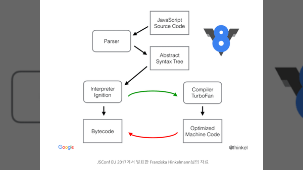
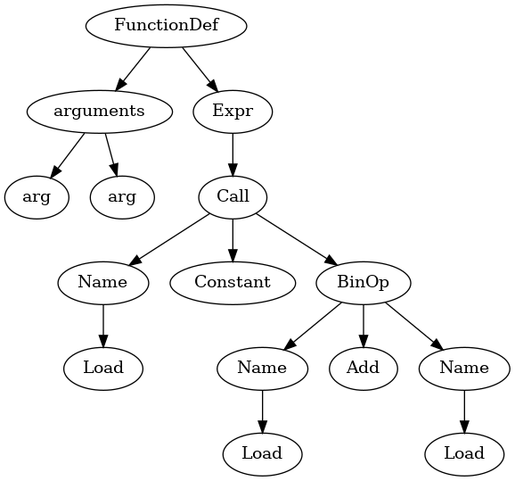
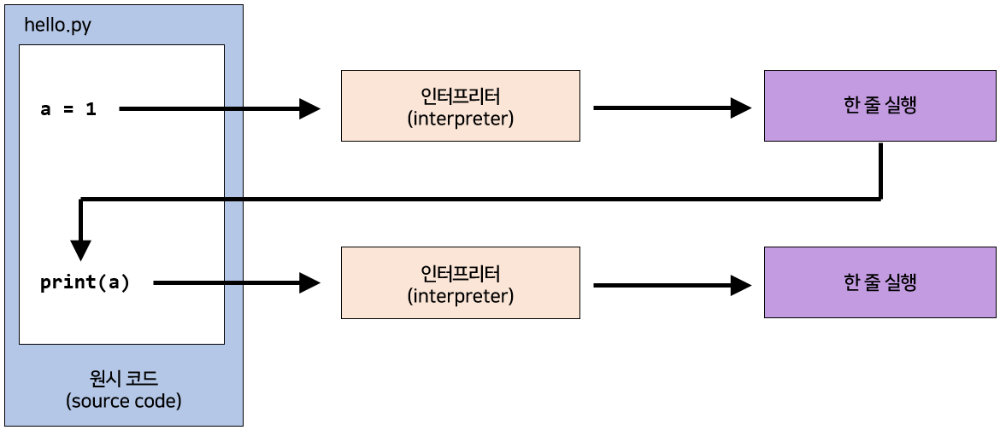
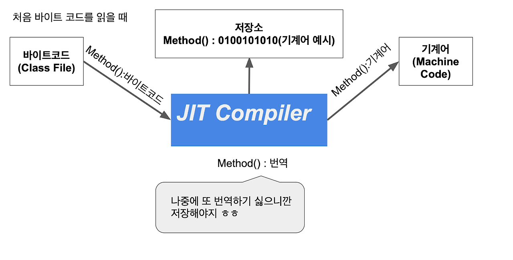
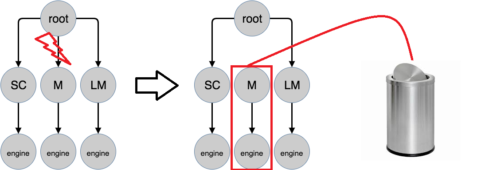
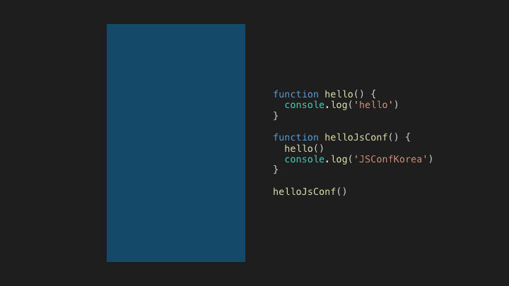
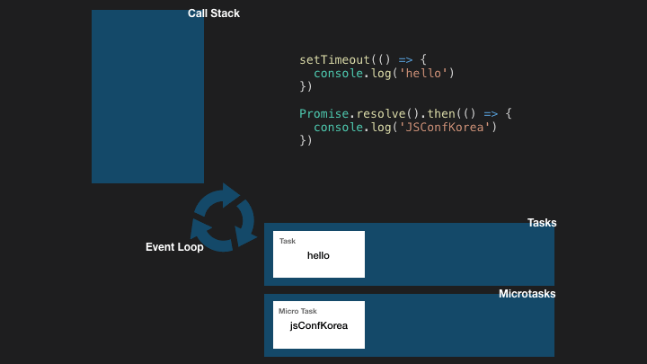
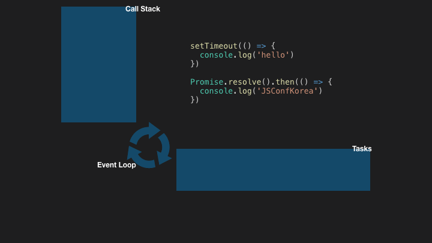

# 자바스크립트 런타임 엔진과 특징
## 자바스크립트 엔진의 작동 원리
자바스크립트 엔진은 자바스크립트 코드를 실행하는 핵심 구성 요소로, 여러 단계를 거쳐 코드를 처리한다.



1. **파싱 (Parsing)**:
   - 자바스크립트 코드를 읽고, 문법적 구조를 이해하기 위해 구문 트리(Syntax Tree)를 생성한다. 이 과정에서 코드의 문법 오류를 검사하고, 유효한 구조인지 확인한다.
   - **추가 설명**: 파싱이 완료되면, 생성된 구문 트리는 AST(Abstract Syntax Tree)라고 불리며, 이는 코드의 구조와 의미를 나타낸다.
   

2. **인터프리팅 (Interpreting)**:
   - 생성된 AST를 바탕으로 실행 가능한 바이트코드를 생성한다. 이 바이트코드는 자바스크립트 엔진이 이해할 수 있는 중간 형태로, 실제 CPU에서 실행되기 전에 해석된다.
   - **추가 설명**: 바이트코드는 메모리에서 효율적으로 실행될 수 있도록 최적화된 형태이다. 인터프리터는 이 바이트코드를 순차적으로 실행한다.
   

3. **JIT(Just-In-Time) 컴파일 (Just-In-Time Compilation)**:
   - 코드 실행 중 성능을 향상시키기 위해, 자주 호출되는 코드나 반복적으로 실행되는 코드의 일부를 기계어로 변환합니다. 이를 통해 코드 실행 속도가 크게 향상된다.
   - **추가 설명**: JIT 컴파일러는 런타임에 동작하므로, 실제 실행 환경에서 최적화된 코드를 생성할 수 있다. 이 과정은 메모리 사용량과 성능 간의 균형을 맞추는 데 중요한 역할을 한다.
   

4. **실행 (Execution)**:
   - 생성된 바이트코드 또는 JIT 컴파일된 기계어 코드는 실제 CPU에서 실행된다. 이 단계에서 변수 할당, 함수 호출, 제어 흐름 등이 처리된다.
   - **추가 설명**: 실행 중에는 메모리 관리와 가비지 컬렉션(Garbage Collection)도 수행되며, 이는 사용되지 않는 메모리를 자동으로 정리하여 메모리 누수를 방지한다.

5. **가비지 컬렉션 (Garbage Collection)**:
   - 자바스크립트 엔진은 사용되지 않는 객체를 자동으로 메모리에서 해제하는 가비지 컬렉션 기능을 제공한다. 이를 통해 메모리 관리를 효율적으로 수행한다.
   - **추가 설명**: 가비지 컬렉션은 주기적으로 실행되며, 참조 카운팅(reference counting)이나 마크-스윕(mark-and-sweep) 알고리즘과 같은 다양한 기법을 사용한다.
   

### 결론

자바스크립트 엔진은 파싱, 인터프리팅, JIT 컴파일, 실행, 가비지 컬렉션의 단계를 통해 자바스크립트 코드를 효율적으로 처리한다. 이러한 과정은 코드의 성능과 메모리 관리를 최적화하여, 개발자가 보다 나은 사용자 경험을 제공할 수 있도록 돕게된다.


### 주요 엔진
- **V8** (Chrome, Node.js)
- **SpiderMonkey** (Firefox)
- **JavaScriptCore** (Safari)

---

## 이벤트 루프와 콜 스택
자바스크립트는 싱글 스레드 기반으로 작동하며, 이벤트 루프와 콜 스택을 통해 비동기 작업을 관리한다.


1. **콜 스택**: 함수 호출을 저장하고 실행 순서를 관리한다.
    

2. **이벤트 루프**: 콜 스택이 비면 태스크 큐에서 작업을 가져와 실행한다.
    

---

## 마이크로태스크와 매크로태스크
자바스크립트는 비동기 작업을 두 가지 큐로 관리한다:
1. **마이크로태스크**: `Promise.then`, `MutationObserver`.
2. **매크로태스크**: `setTimeout`, `setInterval`, `I/O`.



---

## 브라우저와 Node.js의 차이점
- **브라우저**:
  - DOM, Window 객체 제공.
  - 클라이언트 중심의 환경.
- **Node.js**:
  - 파일 시스템, HTTP 모듈 제공.
  - 서버 중심의 환경.

---

## 표현식
```js
// Node.js 이벤트 루프
console.log('Start'); // 1. "Start" 출력 - 동기 코드

setTimeout(() => {
  console.log('setTimeout'); // 3. 매크로 태스크
}, 0);

setImmediate(() => {
  console.log('setImmediate'); // 4. 매크로 태스크
});

Promise.resolve().then(() => {
  console.log('Promise'); // 2. 마이크로 태스크
});

process.nextTick(() => {
  console.log('nextTick'); // 2. 마이크로 태스크
});

console.log('End'); // 1. "End" 출력 - 동기 코드

```